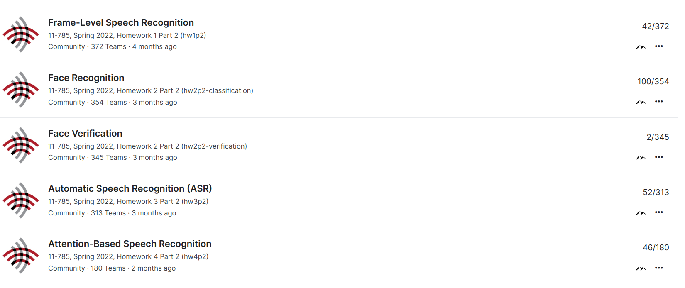

# Deep learning

This repo is a part of the Introduction to Deep Learning course from CMU.

## Table of Contents
- [mytorch](./mytorch)
- [hw1 MLP](./hw1)
- [hw2 CNN](./hw2)
- [hw3 RNN](./hw3)
- [hw4 Attention](./hw4)

## MyTorch
Create a deep learning library from scratch.

## hw1 MLP
Implement simple MLP activations, loss, batch normalization. 

**Kaggle:** [Frame-Level Speech Recognition](https://www.kaggle.com/competitions/11-785-s22-hw1p2)

## hw2 CNN

Implement CNN to solve face recognition and face verification task. 

**Kaggle:** [Face Recognition](https://www.kaggle.com/competitions/11-785-s22-hw2p2-classification)

**Kaggle:** [Face Verification](https://www.kaggle.com/competitions/11-785-s22-hw2p2-verification)

## hw3 RNN

Implement RNN model combined with CNN to solve utterance to phoneme mapping.

**Kaggle:** [Automatic Speech Recognition (ASR)](https://www.kaggle.com/competitions/11-785-s22-hw3p2)

## hw4 Attention

Implement Attention model to solve speech to text transcription.

**Kaggle:** [Attention-Based Speech Recognition](https://www.kaggle.com/competitions/11-785-s22-hw4p2)

## Ranking

