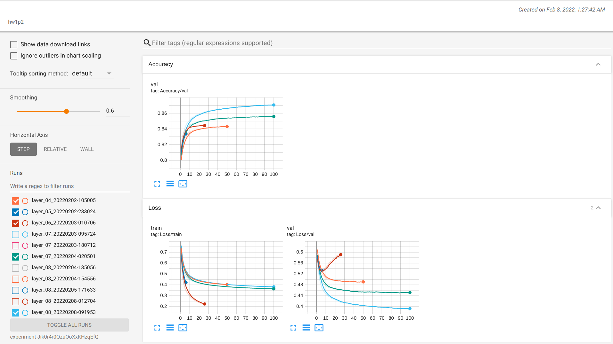
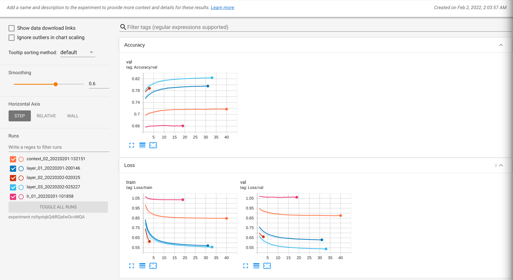

# hw1

## Kaggle competition
[Frame-Level Speech Recognition](https://www.kaggle.com/competitions/11-785-s22-hw1p2)

**User:** Aaron

**Ranking:** 46/372

## Problem Statement
In this competition, you will create a multilayer perceptron for frame-level speech recognition. Specifically, you will create a frame-level phonetic transcription of raw Mel Frequency Cepstral Coefficients (MFCCs). The MLP will learn a feature representation and nonlinear classification boundary. To discriminate between each phoneme class label, cross-entropy loss will be used to minimize the dissimilarity between output logits and the target labels. The loss will be used during gradient descent to update the parameters of the neural network, thereby minimizing the cost function.

## Experiment
| Experiment | Architecture | Context | Second layer | Number of linear layers | Details                                      |
|------------|--------------|---------|--------------|-------------------------|----------------------------------------------|
| Network05  | Pyramid      | 0       | 2048         | 8                       | ReLU, Dropout, Batchnorm every linear layers |
| Network06  | Pyramid      | 0       | 4096         | 9                       | ReLU, Dropout, Batchnorm every linear layers |
| Network07  | Pyramid      | 50      | 2048         | 7                       | ReLU, Dropout, Batchnorm every linear layers |
| Network08  | Cylindrical  | 50      | -            | 9                       | ReLU, Dropout, Batchnorm every linear layers |

[Tensorboard1 - last experiments](https://tensorboard.dev/experiment/Jik0r4r0QzuOoXxKHzqEfQ/#scalars)

[Tensorboard2 - other previous experiments](https://tensorboard.dev/experiment/nzfqotqkQdiRQafwOcvMQA/#scalars)

**Remark**: From the Tensorboard, there are some duplicate experiments due to the resuming process, last version of each environment can be filter by checking the most recent date. For other previous experiments that are not included in the above table, this is because I cannot remember the setup and architecture.
