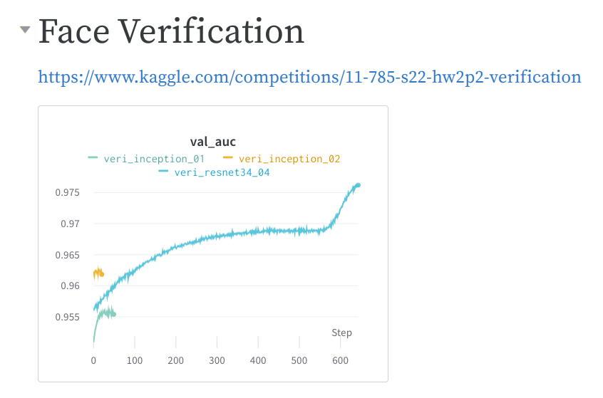

# hw2

## Problem Statement
Face recognition mainly consists of two parts. The task of classifying the ID of the face
is known as face classification, which is a closed-set problem. The task of determining
whether two face images are of the same person is known as face verification, which is an
open-set problem.

## 1. Face Recognition

[Kaggle Competition](https://www.kaggle.com/competitions/11-785-s22-hw2p2-classification)

**Goal:** Given a person’s face, return the ID of the face

**Ranking:** 100/354

**User:** Aaron

## Experiments

[wandb Report](https://wandb.ai/ssiwapol/11785-hw2p2/reports/hw2p2--VmlldzoxNzY2Njgx?accessToken=cnw2srj2nkue1qgrsqw5dpajho9yjspa3kreoy05iy27b1pocubbp2bv9al8zq7o)

| Exp no. |    Exp name    | Model architecture | No. of params | Total epochs | Last train acc | Last val acc | Best epoch | Best val acc |                           Details                          |                  Image transform                  |                   Reference                  |
|:--------|:---------------|:-------------------|:-------------:|:------------:|:--------------:|:------------:|:----------:|:------------:|:-----------------------------------------------------------|:--------------------------------------------------|:---------------------------------------------|
|       1 | base01         | Inverse Pyramid    |   5,151,576   |      50      |     100.00%    |    50.50%    |     45     |    50.44%    | Base model                                                 |                                                   | Starter code                                 |
|       2 | base02         | Inverse Pyramid    |   5,151,576   |      50      |     99.98%     |    53.11%    |     50     |    53.11%    | Base model                                                 | RandomHorizontalFlip, ColorJitter, GaussianBlur   | Starter code                                 |
|       3 | inception_01   | Inception v1       |   27,073,624  |      50      |     99.99%     |    82.11%    |     47     |    82.10%    | Inception v1                                               | RandomHorizontalFlip, ColorJitter, GaussianBlur   | https://github.com/timesler/facenet-pytorch  |
|       4 | convnextT_01   | ConvNeXt           |   33,196,504  |      50      |     94.60%     |    55.87%    |     37     |    53.19%    | ConvNeXt                                                   | RandomHorizontalFlip, ColorJitter, GaussianBlur   | https://github.com/facebookresearch/ConvNeXt |
|       5 | resnet34_01    | ResNet             |   24,875,672  |      50      |     99.99%     |    75.05%    |     48     |    75.08%    | ResNet                                                     | RandomHorizontalFlip, ColorJitter, GaussianBlur   | https://github.com/pytorch/vision            |
|       6 | inception_t_01 | Inception v1       |   24,875,672  |      120     |      0.29%     |     0.34%    |     71     |     0.21%    | Combine 2 losses (CrossEntropyLoss, TripletMarginLoss)     | RandomHorizontalFlip, ColorJitter, GaussianBlur   | https://github.com/timesler/facenet-pytorch  |
|       6 | inception_02   | Inception v1       |   27,073,624  |      60      |     92.60%     |    83.70%    |     59     |    83.74%    | Add more augmentation                                      | + RandomRotation, RandomErasing                   | https://github.com/timesler/facenet-pytorch  |
|       7 | inception_03   | Inception v1       |   27,073,624  |      50      |     78.62%     |    75.75%    |     49     |    75.96%    | Add label smoothing                                        | + RandomRotation, RandomErasing                   | https://github.com/timesler/facenet-pytorch  |
|       8 | resnet34_03    | ResNet             |   24,875,672  |      73      |     79.15%     |    60.15%    |     53     |    84.80%    | ResNet                                                     | + RandomRotation, RandomErasing                   | https://github.com/pytorch/vision            |
|       9 | resnet34_04    | ResNet             |   24,875,672  |      72      |     81.87%     |    67.78%    |     51     |    86.34%    | ResNet (add dropout = 0.1), - Label Smoothing (0.2 to 0.1) | - Rotation (30 to 20), RandomErasing (0.2 to 0.1) | https://github.com/pytorch/vision            |

## 2. Face Verification

[Kaggle Competition](https://www.kaggle.com/competitions/11-785-s22-hw2p2-verification)

**Goal:** Given two faces, return whether they are from the same person

**Ranking:** 2/345

**User:** Aaron

### Experiments

[wandb Report](https://wandb.ai/ssiwapol/11785-hw2p2/reports/hw2p2--VmlldzoxNzY2Njgx?accessToken=cnw2srj2nkue1qgrsqw5dpajho9yjspa3kreoy05iy27b1pocubbp2bv9al8zq7o)

Train from the classification model using TripletMarginLoss

| Exp no. |   Exp name   | Base Val Acc | Total epochs | Last val auc | Best epoch | Best val auc |
|:--------|:-------------|:------------:|:------------:|:------------:|:----------:|:------------:|
|       1 | base_02      |    87.92%    |              |              |            |              |
|       2 | inception_01 |    95.03%    |      50      |    95.54%    |     45     |    95.61%    |
|       3 | inception_02 |    96.24%    |      21      |    96.18%    |     12     |    96.26%    |
|       4 | resnet34_04  |    94.94%    |      703     |    97.62%    |     702    |    97.63%    |

