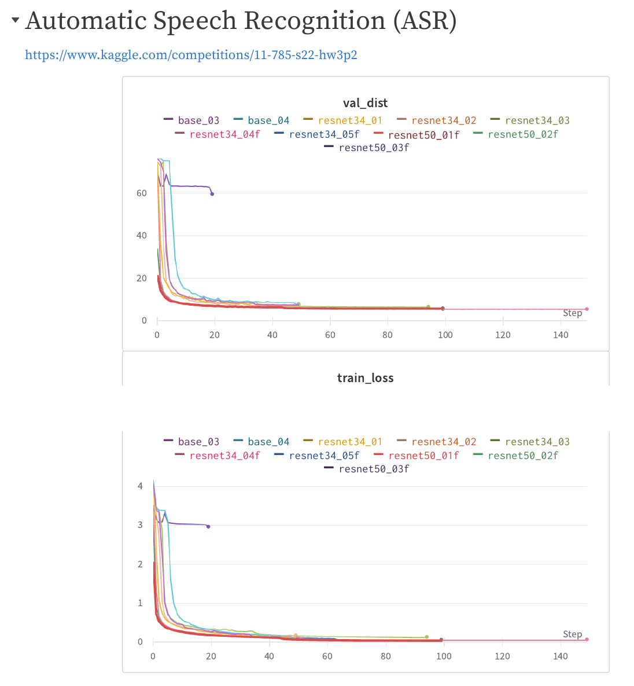

# hw3

## Kaggle competition
[Automatic Speech Recognition (ASR)](https://www.kaggle.com/competitions/11-785-s22-hw3p2)

**User:** Aaron

**Ranking:** 52/313

## Problem Statement

The feature data of this homework are the same as homework 1 part 2. There are many variable length utterances comprised of 13 dimensional timesteps. You can use recurrent layers and their variants. You may also use convolutional layers if you so choose.

Your task will be to take the sequence of features and map them to a sequence of phonemes. Keep in mind the number of phonemes will not equal the number of timesteps. Refer to the write-up for more information.

## Experiments
[wandb Report](https://wandb.ai/ssiwapol/11785-hw3p2/reports/11785-hw3p2--VmlldzoxODI1MDY3?accessToken=jqa1r1qakg766havagmxk3igtemoswafpbwkcu4a5rv0rhpkbjnlqiismekjq6zu)

| Exp no. |   Exp name  | Total epochs | Last train loss | Last val dist | Best epoch | Best val dist |                              Embedding layer                              |                     RNN layer                    |                   Linear layer                  |                            Details                            |             Reference             |
|:-------|:-----------|:------------:|:---------------:|:-------------:|:----------:|:-------------:|:-------------------------------------------------------------------------|:------------------------------------------------|:-----------------------------------------------|:-------------------------------------------------------------|:---------------------------------|
|       1 | base01      |      50      |       1.35      |     33.32     |     50     |     33.32     | -                                                                         | LSTM (layer=1, hidden=256)                       | -                                               | Base model                                                    | Starter code                      |
|       2 | base02      |      50      |       1.94      |     47.14     |     37     |     26.21     | Conv1d (out=64, stride=1)                                                 | LSTM (layer=1, hidden=256)                       | -                                               | base01 + add embedding layer                                  | Starter code                      |
|       3 | base03      |      50      |       0.10      |      7.54     |     39     |      7.53     | Conv1d (out=64, kernel=3, stride=1), Conv1d (out=256, kernel=3, stride=1) | LSTM (layer=4, hidden=256, bi=True, dropout=0.1) | Linear (out=2048)                               | base02 + add embedding layer, adjust LSTM, add linear layer   | Starter code                      |
|       4 | base04      |      50      |       0.10      |      7.89     |     50     |      7.89     | Conv1d (out=64, kernel=3, stride=1), Conv1d (out=256, kernel=3, stride=1) | LSTM (layer=4, hidden=256, bi=True, dropout=0.1) | Linear (out=2048, dropout=0.1)                  | base03 + add dropout                                          | Starter code                      |
|       3 | resnet34_01 |      50      |       0.14      |      7.64     |     49     |      7.36     | BasicBlock (channel=256, kernel=3)                                        | LSTM (layer=4, hidden=256, bi=True, dropout=0.1) | Linear (out=2048, dropout=0.2)                  | Adapted ResNet34 to embedding layer (wrong block structure)   | https://github.com/pytorch/vision |
|       4 | resnet34_02 |      50      |       0.18      |      6.92     |     50     |      6.92     | BasicBlock (channel=256, kernel=3, dropout=0.3)                           | LSTM (layer=4, hidden=256, bi=True, dropout=0.3) | Linear (out=2048, batchnorm, dropout=0.4, ReLU) | resnet34_02 + adjust dropout (wrong block structure)          | https://github.com/pytorch/vision |
|       5 | resnet34_03 |      95      |       0.13      |      6.62     |     92     |      6.61     | BasicBlock (channel=256, kernel=3, stride=1, dropout=0.3)                 | LSTM (layer=4, hidden=256, bi=True, dropout=0.3) | Linear (out=2048, batchnorm, dropout=0.4, ReLU) | Adapted ResNet34 to embedding layer (correct block structure) | https://github.com/pytorch/vision |
|       6 | resnet34_04 |      100     |       0.06      |      5.53     |     99     |      5.52     | BasicBlock (channel=256, kernel=3, stride=2, dropout=0.3)                 | LSTM (layer=4, hidden=256, bi=True, dropout=0.3) | Linear (out=2048, batchnorm, dropout=0.4, ReLU) | resnet34_03 + add stride = 2                                  | https://github.com/pytorch/vision |
|       6 | resnet34_05 |      50      |       0.09      |      5.78     |     49     |      5.77     | BasicBlock (channel=256, kernel=3, stride=2, dropout=0.3)                 | LSTM (layer=4, hidden=256, bi=True, dropout=0.3) | Linear (out=2048, batchnorm, dropout=0.4, ReLU) | resnet34_04 + Kaiming weight initialization                   | https://github.com/pytorch/vision |
|       6 | resnet50_01 |      81      |       0.06      |      5.83     |     81     |      5.83     | Bottleneck (channel=256, kernel=3, stride=2, dropout=0.3)                 | LSTM (layer=4, hidden=256, bi=True, dropout=0.3) | Linear (out=2048, batchnorm, dropout=0.4, ReLU) | Adapted ResNet50 to embedding layer                           | https://github.com/pytorch/vision |

## Experiments - Fix
Fix dataloader module

| Exp no. |   Exp name   | Total epochs | Last train loss | Last val dist | Best epoch | Best val dist |                          Embedding layer                          |                     RNN layer                    |                   Linear layer                  |                    Details                   |             Reference             |
|:-------|:------------|:------------:|:---------------:|:-------------:|:----------:|:-------------:|:-----------------------------------------------------------------|:------------------------------------------------|:-----------------------------------------------|:--------------------------------------------|:---------------------------------|
|       1 | resnet34_04f |      150     |       0.07      |      5.50     |     125    |      5.49     | BasicBlock (channel=256, kernel=3, stride=2, dropout=0.3)         | LSTM (layer=4, hidden=256, bi=True, dropout=0.3) | Linear (out=2048, batchnorm, dropout=0.4, ReLU) | resnet34_04 (fix dataloader)                 | https://github.com/pytorch/vision |
|       2 | resnet34_05f |      100     |       0.05      |      5.59     |     94     |      5.58     | BasicBlock (channel=256, kernel=3, stride=2, dropout=0.3)         | LSTM (layer=4, hidden=256, bi=True, dropout=0.3) | Linear (out=2048, batchnorm, dropout=0.4, ReLU) | resnet34_05 (fix dataloader)                 | https://github.com/pytorch/vision |
|       3 | resnet50_01f |      100     |       0.06      |      5.93     |     63     |      5.92     | Bottleneck (channel=256, kernel=3, stride=2, dropout=0.3)         | LSTM (layer=4, hidden=256, bi=True, dropout=0.3) | Linear (out=2048, batchnorm, dropout=0.4, ReLU) | resnet50_01 (fix dataloader)                 | https://github.com/pytorch/vision |
|       4 | resnet50_02f |      100     |       0.05      |      5.64     |     96     |      5.64     | Bottleneck (channel=256, kernel=3, stride=2, dropout=0.3)         | LSTM (layer=4, hidden=256, bi=True, dropout=0.3) | Linear (out=2048, batchnorm, dropout=0.4, ReLU) | resnet50_01f + Kaiming weight initialization | https://github.com/pytorch/vision |
|       3 | resnet50_03f |      20      |       2.96      |     59.52     |     20     |     59.52     | 2 Bottleneck (channel=512/256, kernel=3, stride=2/1, dropout=0.3) | LSTM (layer=4, hidden=256, bi=True, dropout=0.3) | Linear (out=2048, batchnorm, dropout=0.4, ReLU) | resnet50_02f + add more embedding layer      | https://github.com/pytorch/vision |

## Submited model
resnet34_04f (best validation distance = 5.49)
