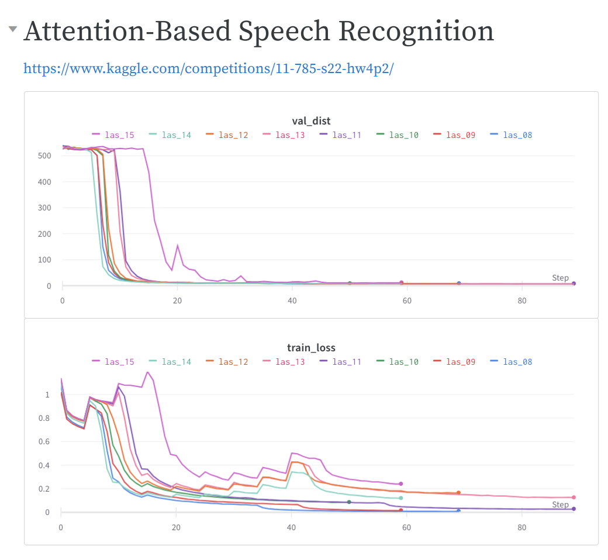

# hw4

## Kaggle competition
[Attention-Based Speech Recognition](https://www.kaggle.com/competitions/11-785-s22-hw4p2)

**User:** Aaron

**Ranking:** 46/180

## Problem Statement

Predict the next phoneme in the sequence
given the corresponding utterances without having the phonemes. You are ONLY given utterances and their corresponding transcripts.

In short, you will be using a combination of Recurrent Neural Networks (RNNs) / Convolutional Neural
Networks (CNNs) and Dense Networks to design a system for speech-to-text transcription. End-to-end, your
system should be able to transcribe a given speech utterance to its corresponding transcript.

Also, it is a requirement to use Attention-Based Speech Recognition.

## Experiments
[wandb Report](https://wandb.ai/ssiwapol/11785-hw4p2/reports/11785-hw4p2--VmlldzoxOTc3MDI3?accessToken=bkp2ludu956asff8tax3wv7wopj36f05jla6z9vuebygh6b72kubnxais885gp1v)

| Exp no. | Exp name | Total epochs | Last train loss | Last val dist | Best epoch | Best val dist | Truncate BLSTM | Details                                                                        |
|---------|----------|:------------:|:---------------:|:-------------:|:----------:|:-------------:|:--------------:|--------------------------------------------------------------------------------|
| 1       | las_01   |      50      |       0.07      |     13.01     |     25     |     12.79     |      mean      | LAS base model, encoder dropout=0.2, attn dropout=0.1, max teacher forcing=0.7 |
| 2       | las_02   |      28      |       1.17      |     528.12    |     10     |     522.23    |      mean      | las_01 + locked-drop=0.5                                                       |
| 3       | las_03   |      31      |       1.17      |     530.97    |     10     |     521.66    |      mean      | las_01 + locked-drop=0.5 + encoder dropout=0.4 + attn dropout=0.4              |
| 4       | las_04   |      70      |       0.02      |      8.81     |     58     |      8.52     |      mean      | las_01 + locked-drop=0.2 + encoder dropout=0.2 + attn dropout=0.2              |
| 5       | las_05   |      40      |       0.08      |     11.88     |     36     |     11.74     |     concat     | las_01 + locked-drop=0.2 + encoder dropout=0.2 + attn dropout=0.2              |
| 6       | las_06   |      60      |       0.02      |      8.76     |     46     |      8.69     |       max      | las_01 + locked-drop=0.2 + encoder dropout=0.2 + attn dropout=0.2              |
| 7       | las_07   |      70      |       0.01      |      8.91     |     54     |      8.50     |       max      | las_06 + add 1 lstm cell                                                       |
| 8       | las_08   |      70      |       0.01      |      9.08     |     54     |      8.64     |       max      | las_07 + add batchnorm between BLSTM (encoder)                                 |
| 9       | las_09   |      60      |       0.02      |      8.91     |     54     |      8.86     |       max      | las_08 + locked-drop=0.3 + encoder dropout=0.3 + attn dropout=0.3              |
| 10      | las_10   |      51      |       0.09      |      9.29     |     49     |      9.15     |       max      | las_08 + dropout between LSTM cell (decoder)                                   |
| 11      | las_11   |      90      |       0.03      |      8.25     |     80     |      8.21     |     concat     | las_10 + adjust truncate                                                       |
| 12      | las_12   |      70      |       0.17      |      8.93     |     64     |      8.83     |       max      | las_10 + max teacher forcing=0.2                                               |
| 13      | las_13   |      90      |       0.13      |      8.57     |     73     |      8.48     |     concat     | las_10 + max teacher forcing=0.2                                               |
| 14      | las_14   |      60      |       0.12      |      9.20     |     55     |      8.71     |      mean      | las_10 + max teacher forcing=0.2                                               |
| 15      | las_15   |      60      |       0.24      |     12.69     |     55     |     11.97     |     concat     | las_13 + swap dropout and batchnorm at encoder                                 |

## Submited model
las11 (best validation distance = 8.25)
